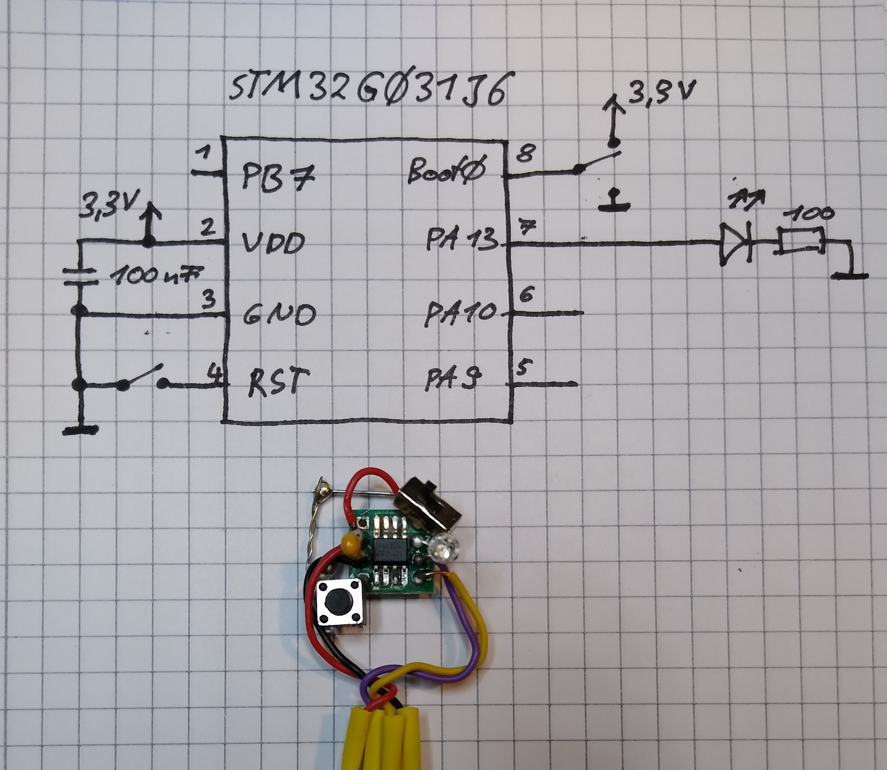

# stm32g031
DIY projects with the STM32G031 and STM32G030 microcontroller

## STM32G031J6
 * 8-Pin SON
 * J6: 8 pins with 32KB Flash
 * Examples with `_6` postfix

  

## STM32G030J6
 * 8-Pin SON
 * Doesn't have low power timer and low power USART (compared to STM32G031J6)
 * J6: 8 pins with 32KB Flash
 * Examples with `_6` postfix
 

## STM32G031F8P6
 * TSSOP20
 * F8: 20 pins with 64KB Flash
 * Examples with `_8` postfix: 64KB Flash STM32G031x8